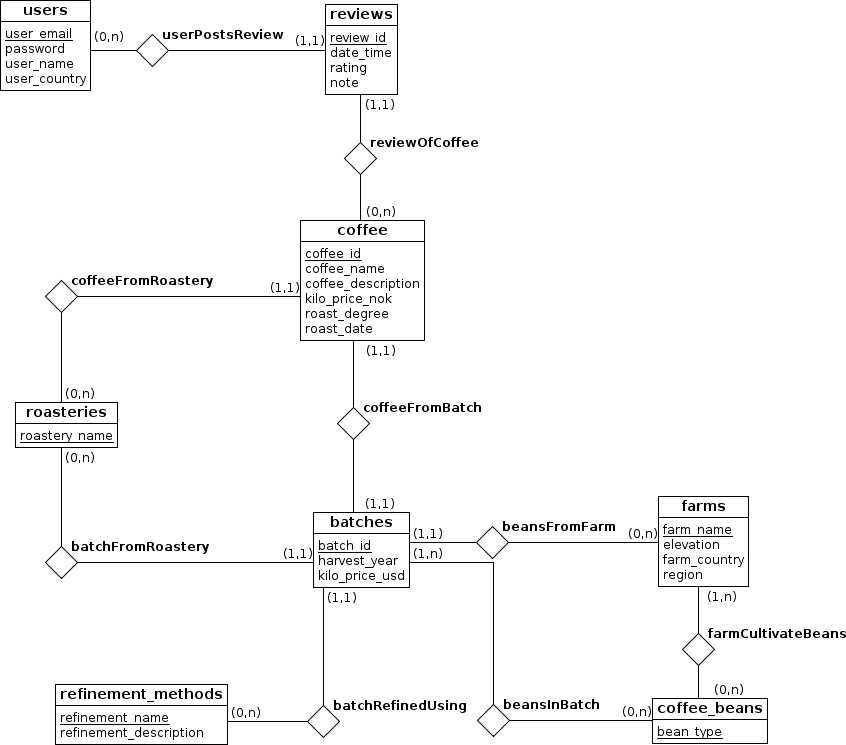
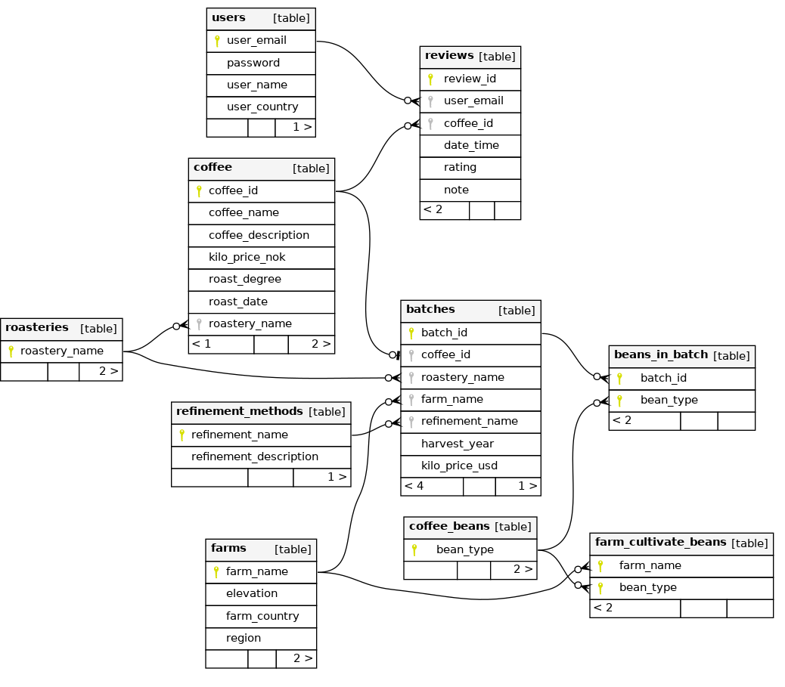

# KaffeDB

## Overview
Project submission for [TDT4145 Data Modelling, Databases and Database Management Systems ](https://www.ntnu.edu/studies/courses/TDT4145) at NTNU. We were tasked with creating and implementing a database design that satisfied some provided [user stories](./docs/prosjekt2022-norsk.pdf), all related to submitting and querying coffee tasting reviews.

The main focus was coming up with a good database design, with apropriate [normalization](https://en.wikipedia.org/wiki/Database_normalization), primary keys, foreign keys and restrictions.

## Technologies
We used [SQLite3](https://www.sqlite.org) for the database and the [corresponding Python API](https://docs.python.org/3/library/sqlite3.html) for the application. [SchemaSpy](https://schemaspy.readthedocs.io) was used to visualize the database schema. The project report was written in [LaTeX](https://www.latex-project.org) with [Lua](https://www.lua.org) so that we could output queries from the database directly into the PDF.

### Entity-Relationship diagram


### Database schema


All tables are in [4NF](https://en.wikipedia.org/wiki/Fourth_normal_form).

#### User story (example)
We had to show how the following user story could be satisfied with our design:
> A user is tired of being disappointed by washed coffees and their occassionally quite boring taste profile, and therefore wishes to search for coffees from Rwanda and Colombia which are not washed. The application returns a list of roastery names and coffee names.

The following SQL query returns matching coffees:

```sql
SELECT roastery_name, coffee_name
FROM (
  SELECT farm_name FROM farms
  WHERE farm_country IN ('Rwanda', 'Colombia')
  ),
  (
    SELECT refinement_name FROM refinement_methods
    WHERE refinement_name != 'washed'
  )
NATURAL JOIN batches
NATURAL JOIN coffee;
```
